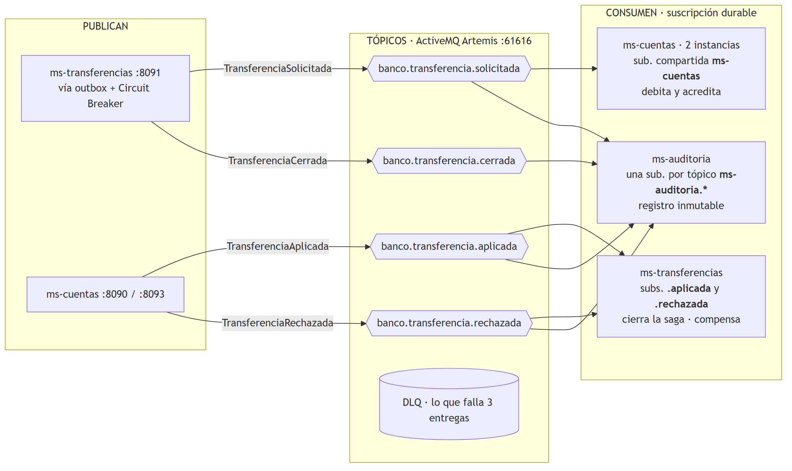
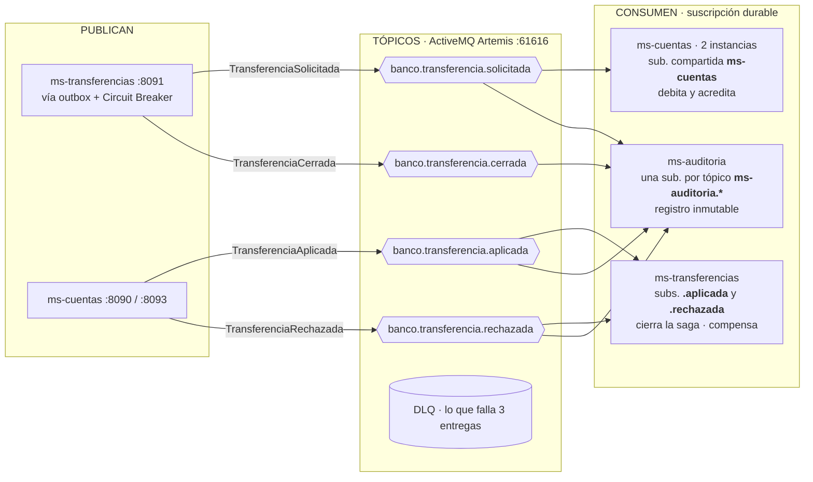
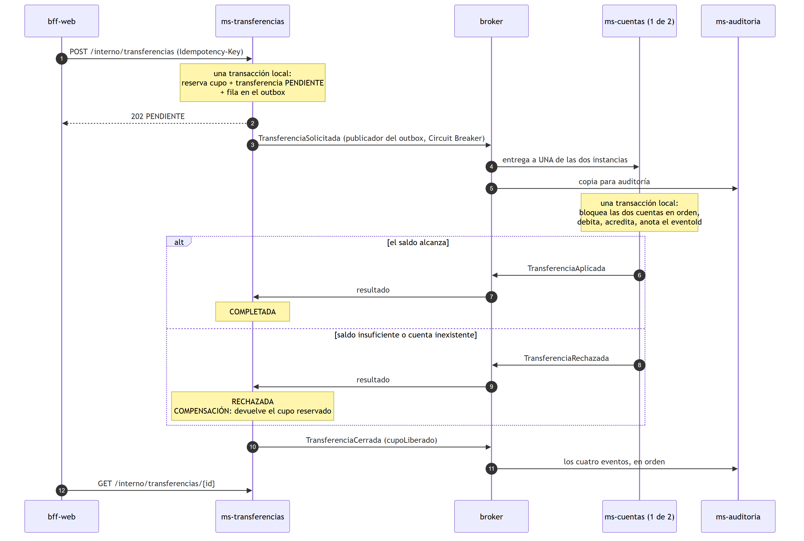
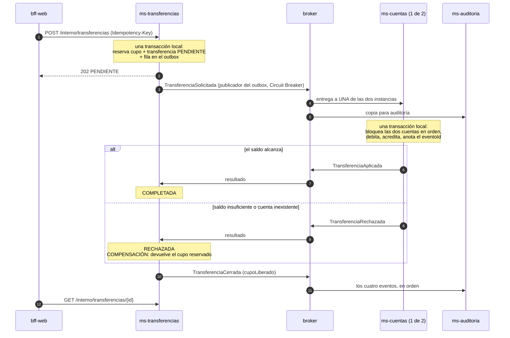

# bank-cloud — PBY2203 Desarrollo Backend III · Experiencia 3, Semana 8

**Desarrollando microservicios y resiliencia en la nube con Spring Cloud**

> **Documentación en actualización.** Esta versión ya incluye lo nuevo de la semana 8
> —servidor de autorización OAuth 2.0 (`auth-server`), imágenes Docker de todos los
> servicios (`Dockerfile`) y la orquestación completa (`docker-compose.yaml`)—, pero el
> texto que sigue todavía describe la base de la semana 7. La documentación de la semana 8,
> con su evidencia de ejecución en la nube, reemplazará esta sección.

---

## Base: semana 7

**Configurando tolerancia a fallos y arquitectura de eventos con microservicios en la nube**

Continuidad directa de la semana 6. Allí el ecosistema era enteramente síncrono: tres BFF
llamando por HTTP a `ms-cuentas`, protegidos con Circuit Breaker. Esta entrega agrega la otra
mitad: **una Saga coreografiada de transferencias entre cuentas** que viaja por eventos JMS
sobre un broker ActiveMQ Artemis, con dos microservicios nuevos y `ms-cuentas` escalado a
dos instancias.

Actividad formativa grupal.

---

## Índice de la entrega

| Aspecto | Dónde está |
|---|---|
| **1. Código fuente** | `bank-cloud/` — proyecto Maven de 13 módulos, y en <https://github.com/FcoXavierParra/PBY2203_S7_GRUPO_17> |
| **2. Documentación** | este `README.md`; los diagramas de tópicos y eventos están en la [sección 3](#3-el-diagrama-tópicos-mensajes-y-eventos) y, como imagen, en `diagramas/` |
| **3. Evidencia de ejecución** | `evidencias/01_eventos_y_resiliencia_h2.txt` (lo nuevo) y `evidencias/02_regresion_semana6_h2.txt` (lo de la semana 6, sigue funcionando) |

Cómo se cubre cada criterio de la pauta:

| Criterio | Sección | Evidencia |
|---|---|---|
| Define la arquitectura de eventos y el patrón | [2](#2-la-decisión-de-arquitectura) | — |
| Diagrama con tópicos, mensajes y eventos | [3](#3-el-diagrama-tópicos-mensajes-y-eventos), [4](#4-catálogo-de-eventos) | — |
| Tolerancia a fallos con Resilience4j | [6](#6-tolerancia-a-fallos) | secciones 9 a 12 |
| Mensajería asíncrona funcional y escalabilidad demostrada | [5](#5-garantías-de-entrega-y-duplicados), [7](#7-escalabilidad) | secciones 2 a 8 |

---

## 1. De dónde viene esta entrega

### La sugerencia de la semana 6, y lo que destapó

La retroalimentación de la semana 6 cerró con una propuesta: *"sería interesante probar qué
ocurre cuando Config Server o Eureka no están disponibles al momento de iniciar los demás
servicios"*.

La prueba encontró un defecto real. Los cuatro microservicios de la semana 6 declaraban en su
`application.yml` seis reintentos contra el Config Server, con un comentario que decía que
eso "cubre su arranque". **No lo cubría:** Spring Cloud Config solo reintenta si
`spring-retry` y `spring-boot-starter-aop` están en el classpath, y no estaban. Sin ellos el
bloque `retry` se ignora en silencio y, con `fail-fast`, el servicio moría al primer intento.
Funcionaba solo porque `levantar.ps1` no arrancaba ningún servicio hasta ver al Config Server
arriba.

La evidencia de esta semana lo muestra **antes y después**: corre el jar de la semana 6 y el
de esta con el Config Server abajo (sección 11), y además prueba la operación y el arranque
sin Eureka (sección 12).

### Otros dos defectos de la semana 6, encontrados al construir esta

| Defecto | Por qué no se había visto | Corrección |
|---|---|---|
| `bank-core` y `bank-seguridad` declaraban como padre `bank-bff`, el proyecto de la **semana 5** | Maven lo encontraba en el repositorio local de quien lo desarrolló. En un clon limpio, `mvn package` falla | El padre es `bank-cloud` |
| `OperacionService.retirar` leía el saldo sin bloqueo; su javadoc afirmaba que `@Transactional` bastaba | Con un solo `ms-cuentas` y peticiones de a una, dos retiros nunca coincidían | `SELECT … FOR UPDATE` (`CuentaRepository.bloquear`). Con dos instancias procesando una ráfaga, deja de ser teórico |

---

## 2. La decisión de arquitectura

### El caso de uso: transferencias entre cuentas

Se eligió porque es el caso bancario que **necesita** una transacción distribuida. Una
transferencia toca datos de dos servicios con bases distintas:

- el **cupo diario** de transferencias de la cuenta de origen, que es de `ms-transferencias`;
- los **saldos** de las dos cuentas, que son de `ms-cuentas`.

No existe una transacción que abarque las dos bases. Si `ms-transferencias` reserva el cupo y
después `ms-cuentas` descubre que el saldo no alcanza, la reserva ya está confirmada y no
hay rollback posible: hay que **compensarla**.

### El patrón: Saga coreografiada

| Alternativa de la guía | Por qué sí o por qué no |
|---|---|
| **Saga coreografiada** ✔ | Cada servicio reacciona a hechos publicados por otro, sin que nadie le dé órdenes. `ms-transferencias` no sabe que `ms-cuentas` existe; agregar un tercer interesado es suscribirlo a un tópico. Con dos participantes y tres pasos, el flujo se sigue sin esfuerzo |
| Saga orquestada | Tendría sentido con seis participantes, cuando el flujo repartido se vuelve difícil de seguir. Aquí agregaría un servicio central sin resolver un problema que exista |
| Event Sourcing para los saldos | El saldo de cada cuenta lo calculó el batch de la Experiencia 1 y vive como una columna. No existe su historia como eventos; reemplazarlo obligaría a inventarla |
| Event Sourcing para la auditoría ✔ | Sí se usa, en su medida justa: `ms-auditoria` no guarda en qué estado está una transferencia, guarda lo que le pasó, y **calcula** el estado aplicando los eventos en orden |

El costo de la coreografía es que el flujo no está escrito en un solo lugar del código. Por
eso existen el diagrama de la sección 3 y `ms-auditoria`, que es donde el flujo completo sí se
ve.

### La tecnología: JMS con ActiveMQ Artemis, embebido

| | JMS / Artemis | Kafka |
|---|---|---|
| Lo que dice la guía | "colas… ideal para tareas punto a punto, como procesar transacciones bancarias" | "procesamiento de eventos y flujos de datos en tiempo real" a gran escala |
| Garantías que la saga necesita | sesiones transaccionadas, reentrega con espera, cola de mensajes muertos y detección de duplicados, **incluidas en el broker** | reentrega y DLQ se arman en el cliente |
| Reparto de carga | suscripciones compartidas (JMS 2.0) | grupos de consumidores y particiones |
| Reproducible al corregir | un módulo más del Maven: `mvn package` y se levanta | requiere Docker o una instalación aparte |

Artemis es la implementación JMS que Spring Boot soporta de primera mano y el sucesor de
ActiveMQ "Classic", que es el que muestra la guía. Va **embebido en su propio jar**
(`broker-mensajeria`), por la misma razón por la que el Config Server usa el perfil `native`:
que cualquiera que clone el proyecto levante el ecosistema completo sin instalar nada. Sigue
siendo un proceso aparte con su propio ciclo de vida; embeberlo *dentro* de un microservicio
haría imposible mostrar que un consumidor caído no pierde eventos.

---

## 3. El diagrama: tópicos, mensajes y eventos

Dos vistas complementarias: **quién publica y quién consume cada tópico**, y **la saga en el
tiempo**. GitHub las dibuja a partir del código Mermaid de abajo; las mismas dos, como
imagen, están en `diagramas/` (PNG y SVG) para leerlas fuera de GitHub.

### Quién publica y quién consume



<details>
<summary>Código Mermaid del diagrama</summary>



</details>

Cada flecha de la izquierda es un **permiso de publicar** en el broker, y ninguno más: por
eso `ms-auditoria` no aparece en esa columna. La DLQ no tiene publicador: el broker aparta ahí
por su cuenta lo que no se pudo procesar en tres entregas.

Cada servicio tiene su base: `ms-cuentas` la de saldos (compartida por sus dos instancias,
porque son **el mismo servicio escalado**, no dos servicios), `ms-transferencias` la de cupos
y outbox, y `ms-auditoria` la del registro.

### La saga en el tiempo: camino feliz y compensación



<details>
<summary>Código Mermaid del diagrama</summary>



</details>

---

## 4. Catálogo de eventos

Todos los eventos llevan `eventoId` (identifica **este mensaje**; es la base de la
deduplicación), `transferenciaId` (identifica **la saga**; todos sus eventos lo comparten) y
`ocurridoEn`. Viajan como JSON en un `TextMessage`, con el nombre del tipo en la propiedad
`_tipo`: un contrato legible por cualquier cliente, que se puede inspeccionar en la DLQ, sin
deserializar objetos Java que llegan por la red.

| Tópico | Evento | Publica | Consumen | Campos propios |
|---|---|---|---|---|
| `banco.transferencia.solicitada` | `TransferenciaSolicitada` | ms-transferencias | ms-cuentas, ms-auditoria | origen, destino, monto |
| `banco.transferencia.aplicada` | `TransferenciaAplicada` | ms-cuentas | ms-transferencias, ms-auditoria | causaEventoId, saldos resultantes, `procesadoPor` (la instancia) |
| `banco.transferencia.rechazada` | `TransferenciaRechazada` | ms-cuentas | ms-transferencias, ms-auditoria | causaEventoId, motivo, `procesadoPor` |
| `banco.transferencia.cerrada` | `TransferenciaCerrada` | ms-transferencias | ms-auditoria | estadoFinal, `cupoLiberado` (distinto de cero solo si hubo compensación) |

**Un tópico por tipo de hecho**, y no uno solo con todo mezclado: cada suscriptor recibe solo
lo que le importa y, sobre todo, los permisos se pueden dar por tópico (sección 8). Los
nombres están en participio porque describen algo que **ya ocurrió**: eso distingue una
coreografía, donde se anuncian hechos, de una orquestación, donde se dan órdenes.

Un rechazo por saldo insuficiente es un **hecho de negocio**, no un error: el mensaje se
procesó bien y la respuesta es "no". Sigue la saga y dispara la compensación. Una excepción
al procesar, en cambio, hace rollback, se reintenta y, si persiste, va a la DLQ.

---

## 5. Garantías de entrega y duplicados

La entrega es **at-least-once**: ningún evento se pierde por una falla a mitad de proceso, a
cambio de que alguno pueda llegar dos veces. Lo que la vuelve efectivamente *exactly-once* en
sus efectos son tres capas, que la evidencia prueba **por separado** (sección 6):

| Capa | Estrategia de la guía | Implementación |
|---|---|---|
| HTTP | identificadores únicos | `Idempotency-Key` con restricción de unicidad en `ms-transferencias`. Un doble clic devuelve la misma transferencia. La clave se antepone con la cuenta del titular, para que dos usuarios no choquen |
| Broker | desduplicación en el intermediario | cada evento se publica con `_AMQ_DUPL_ID = eventoId`; Artemis recuerda los últimos 5.000 en disco y descarta el reenvío |
| Consumidor | persistencia en el consumidor | tabla `evento_procesado` con `eventoId` como clave primaria, **escrita en la misma transacción que mueve los saldos** |

Y los reintentos son controlados: tres entregas con espera creciente (1 s, 2 s, 4 s) y a la
**DLQ**, para que un mensaje que nunca se va a poder procesar no bloquee a los que vienen
detrás.

### Por qué hace falta el outbox

Aceptar una transferencia son dos escrituras en dos sistemas: la base y el broker. En
cualquier orden hay un hueco: con el broker caído la transferencia queda PENDIENTE para
siempre sin que nadie se entere, o `ms-cuentas` mueve dinero de una transferencia que nunca
quedó registrada. El outbox guarda el evento como una fila **en la misma transacción** que la
transferencia, y un publicador lo envía después. Si el broker no está, la fila espera.

---

## 6. Tolerancia a fallos

| Qué falla | Mecanismo | Qué ve el usuario | Evidencia |
|---|---|---|---|
| El broker | Outbox + **Circuit Breaker** `broker` en la publicación | 202, la transferencia se acepta igual y se completa cuando el broker vuelve | sección 9 |
| Un consumidor | Suscripción **durable** + journal persistente | nada: la saga no depende de la auditoría | sección 10 |
| Un mensaje ilegible | Sesión transaccionada, 3 entregas, **DLQ** | nada: la suscripción sigue avanzando | sección 7 |
| Una instancia de ms-cuentas | Suscripción compartida | nada: la otra absorbe la carga | sección 8 |
| ms-transferencias | **Circuit Breaker + Retry** `msTransferencias` en bff-web | 503 con mensaje propio del canal | — |
| ms-cuentas (las dos instancias) | Circuit Breaker `msCuentas`, de la semana 6 | degradación distinta por canal | regresión, sección 6 |
| El Config Server al arrancar | `spring-retry`: 20 intentos, de 2 s a 15 s | el servicio espera en vez de morir | sección 11 |
| Eureka | copia local del registro en cada cliente | los que están arriba siguen; los que arrancan degradan hasta que vuelve | sección 12 |

### Ahora sí se reintenta la operación que mueve dinero

En la semana 6 el retiro del cajero **no** llevaba `@Retry`, y quedó documentado por qué: sin
clave de idempotencia, reintentar una operación que ya pudo aplicarse es la forma clásica de
cobrar dos veces. Esta semana la clave existe, así que `ClienteTransferencias.solicitar` sí
lleva `@Retry`: si la respuesta se pierde, el segundo intento recibe la transferencia que el
primero ya creó.

### El Circuit Breaker del outbox protege otra cosa

En los BFF el circuito protege a una persona que espera. En el outbox nadie espera: la
transferencia ya se aceptó. Lo que protege es al propio servicio y al broker. Sin el
circuito, con cien filas pendientes se harían cien intentos cada medio segundo, y cuando el
broker volviera lo recibiría una avalancha de reconexiones justo mientras arranca. Por eso sus
números son propios: se abre después de tres fallos seguidos, se queda abierto 15 s y en
HALF_OPEN deja pasar una sola sonda.

Lo que la evidencia registró, observando el circuito cada 2 s con el broker muerto de verdad
(sección 9):

```
    t=   0 s  circuito CLOSED    outbox pendientes 3  (broker caido)
    t=   9 s  circuito OPEN      outbox pendientes 3
    t=  23 s  circuito HALF_OPEN outbox pendientes 3
    t=  27 s  circuito OPEN      outbox pendientes 3
    t=  34 s  circuito OPEN      outbox pendientes 3  (se relanza el broker)
       ...    OPEN / HALF_OPEN mientras el broker arranca
    t= 119 s  circuito CLOSED    outbox pendientes 0
```

Las tres transferencias pedidas con el broker caído recibieron **202** en el acto y terminaron
**COMPLETADA** sin que nadie reiniciara `ms-transferencias` ni `ms-cuentas`. El circuito no
abre al instante: con el broker abajo cada intento de conexión tarda unos segundos en
fallar, y abre al tercero. Cada sonda de HALF_OPEN que falla lo devuelve a OPEN; la primera
que encuentra al broker publica, y el outbox se vacía completo en la vuelta siguiente.

### Un caso real de reintento con idempotencia

No estaba planeado. Una corrida hecha justo después de levantar el ecosistema recibió
**503** en su primera transferencia, a los 14,7 s:

1. La primera solicitud a un `ms-transferencias` recién arrancado tardó más que los 2,5 s de
   timeout de lectura de `bff-web`.
2. `bff-web` la **reintentó con la misma `Idempotency-Key`**; el reintento también llegó tarde
   y el canal respondió con su degradación.
3. Pero la transferencia **sí se había aplicado, y una sola vez**: `ms-transferencias`
   registraba exactamente una completada y el saldo había bajado lo que correspondía.

Es exactamente el caso para el que la semana 6 dejó escrito que el retiro no debía
reintentarse, y para el que esta semana existe la clave: sin ella, ese reintento habría
cobrado dos veces. La evidencia final hace tres solicitudes de calentamiento —rechazadas
por cupo, no mueven dinero— antes de medir.

### Sin Config Server y sin Eureka

Con el Config Server detenido, el mismo servicio en sus dos versiones (sección 11):

| | jar de la semana 6 | jar de esta semana |
|---|---|---|
| a los 60 s | ya había terminado, a los **38 s** | **vivo**, reintentando |
| cómo terminó | `ConfigClientFailFastException: Could not locate PropertySource and the fail fast property is set` | el Config Server volvió a los 95 s y el servicio quedó **UP a los 252 s, tras 7 intentos fallidos**, sin que nadie lo relanzara |

Los servicios que ya estaban arriba no se enteran: la configuración se lee al arrancar, y
`bff-web` siguió respondiendo 200 durante toda la prueba.

Con Eureka detenido (sección 12) hay que distinguir dos casos:

| | qué pasa |
|---|---|
| servicios que **ya estaban** arriba | siguen: cada cliente guarda una copia local del registro. `bff-web` respondió 200 y completó una saga sin Eureka |
| servicio que **arranca** sin Eureka | arranca igual —Eureka no es requisito para arrancar—, pero no sabe dónde está nadie: `bff-movil` respondió **503** con la degradación de su canal |
| cuando Eureka vuelve | las siete instancias se vuelven a registrar en su siguiente latido y `bff-movil` pasa a **200** sin reiniciarse |

Un detalle que costó entender al leer los logs: los intentos contra el Config Server **no
aparecen en el log mientras ocurren**. Spring Boot retiene los mensajes previos a configurar
el logging y los escribe todos juntos al final, con la misma marca de tiempo. Por eso el jar
de la semana 6, que muere antes de ese punto, no deja ninguna línea de sus intentos: solo la
excepción final.

---

## 7. Escalabilidad

`ms-cuentas` corre en **dos instancias del mismo jar** (8090 y 8093). Las dos se suscriben a
`banco.transferencia.solicitada` con el **mismo nombre de suscripción compartida**, y el broker
les reparte los eventos en vez de darle una copia a cada una: es el equivalente JMS de un
grupo de consumidores de Kafka. Agregar una tercera instancia es arrancarla; no se toca ni una
línea de configuración.

La medición usa una ráfaga de 40 transferencias cargadas de una sola vez por el endpoint de
lote de `ms-transferencias`, para que lo que se mida sea el consumidor y no la velocidad con
que PowerShell lanza procesos `curl`. Cada instancia tiene **un** consumidor, para medir el
efecto de agregar instancias y no hilos, y un costo **simulado** de 200 ms por evento que
representa la consulta al motor antifraude que un banco real haría antes de mover dinero (es
un valor de la configuración y la evidencia lo declara).

| | una instancia | dos instancias |
|---|---|---|
| 40 transferencias cerradas en | 9,3 s | 5,5 s |
| rendimiento | 4,3 transferencias/s | **7,3 transferencias/s (1,7x)** |
| reparto | 8090: 40 | 8090: 20 · 8093: 20 |
| suma de todos los saldos del banco | 424.000 antes · 424.000 después | ← la misma, después de las 80 |

Lo más probable es que no llegue a 2x porque parte de cada saga no escala con `ms-cuentas`:
el publicador del outbox revisa cada medio segundo y `ms-transferencias` es una sola
instancia. No se midió por separado. Para quitar la segunda
instancia no hubo que reconfigurar nada: se detuvo el proceso, el broker vio que la
suscripción bajaba a un consumidor y la otra instancia absorbió todo.

La suma de todos los saldos del banco se mide antes y después: una transferencia mueve dinero,
no lo crea ni lo destruye. Con dos instancias debitando a la vez las mismas cuentas, eso se
sostiene por el bloqueo pesimista, tomado **siempre en orden de número de cuenta** para que
dos instancias no queden esperándose en círculo.

### Un error que costó encontrar

En Artemis una suscripción compartida sin `clientID` es una cola que se llama exactamente
como la suscripción, y ese nombre es **único en todo el broker**. La primera versión usó
"ms-auditoria" en los cuatro tópicos: solo se creó la cola del primero, los otros tres quedaron
sin suscriptor, y las transferencias quedaban en PENDIENTE para siempre **sin un solo error en
el log**. La convención quedó en `servicio.hecho` (`ms-auditoria.aplicada`) y está explicada en
`EventosConfig`.

---

## 8. Seguridad

### Lo que está protegido

- **El origen de una transferencia sale del token**, nunca del cuerpo. Si el navegador manda
  otra cuenta de origen, se ignora; la evidencia lo prueba (sección 5a). Es la lección del IDOR
  de la semana 5, aplicada esta vez a una operación que mueve dinero.
- **Consultar una transferencia exige ser su titular.** El identificador es un UUID imposible
  de adivinar, pero "difícil de adivinar" no es un control de acceso: los UUID aparecen en
  logs, historiales y capturas.
- **Una credencial de servicio nueva, `svc-transferencias`**, que solo recibe `bff-web`. La de
  consulta que ya tenía no puede iniciar transferencias.
- **`ms-auditoria` es de solo lectura también por HTTP**: solo acepta GET. Los eventos entran
  únicamente por el broker.
- **En el broker, cada servicio publica solo los hechos de los que es dueño:**

  | Tópico | Publica | Consume |
  |---|---|---|
  | `.solicitada` | ms-transferencias | ms-cuentas, ms-auditoria |
  | `.aplicada`, `.rechazada` | ms-cuentas | ms-transferencias, ms-auditoria |
  | `.cerrada` | ms-transferencias | ms-auditoria |
  | `DLQ` | (el broker) | administrador |

  Si `ms-auditoria` quedara comprometido, podría leer los eventos —eso ya puede por diseño—
  pero no publicar un `TransferenciaAplicada` falso para que se diera por hecha una
  transferencia que nunca ocurrió. El broker lo rechaza; la evidencia lo prueba (sección 5d).
- **Las direcciones del broker se declaran; la autocreación está apagada.** Un productor que
  escribe mal un tópico falla en el acto, en vez de crear uno nuevo donde nadie escucha.

Todo lo de la semana 6 sigue vigente —TLS por canal, clave de firma por canal, autorización
por cuenta— y la evidencia de regresión lo comprueba.

### Alcance de lo implementado

| | aquí | en producción |
|---|---|---|
| broker | embebido, un nodo, en localhost | clúster Artemis o servicio administrado, con TLS en el 61616 |
| usuarios del broker | en el Config Server, en claro con variable de entorno para reemplazarlos | LDAP o un gestor de secretos |
| costo de procesamiento | 200 ms simulados | la consulta real al motor antifraude |
| base de ms-cuentas | H2 compartida entre instancias con `AUTO_SERVER` | la misma Oracle para las dos (el perfil `oracle` ya existe) |
| timeout de la saga | una transferencia sin respuesta queda PENDIENTE | un vencimiento que la rechace y compense |

---

## 9. Cómo ejecutar

### Requisitos

- **JDK 21** y **Maven 3.9+**
- **Windows con PowerShell 5.1** y `curl.exe`
- Unos **4 GB de RAM libres**: son diez JVM, con el heap de cada una fijado en `comun.ps1`

### Puesta en marcha

```powershell
cd bank-cloud
mvn clean package -DskipTests
.\levantar.ps1                 # diez procesos, por etapas; unos 15 minutos en el equipo de desarrollo
.\probar_eventos.ps1           # evidencia de la semana 7
.\comparar_canales.ps1         # regresión de la semana 6
.\levantar.ps1 -Detener
```

`levantar.ps1` borra las bases H2 y el journal del broker al empezar, así que cada corrida
parte del dataset oficial y sin mensajes pendientes. También arranca o detiene un servicio
suelto: `.\levantar.ps1 -Servicio ms-auditoria [-Detener]`.

### Puertos

| servicio | puerto |
|---|---|
| config-server | **7888** |
| eureka-server | 8761 |
| broker-mensajeria | 61616 (JMS), 8161 (consola) |
| ms-cuentas | 8090 y 8093 |
| ms-transferencias | 8091 |
| ms-auditoria | 8092 |
| bff-web / bff-movil / bff-cajero | 8081 / 8082 / 8083 (HTTPS) |

El Config Server pasó del 8888 de la semana 6 al **7888**. En el equipo de desarrollo el 8888
dejó de poder abrirse —Tomcat fallaba con *Port 8888 was already in use* sin que `netstat`
mostrara a nadie escuchando—, y el número no tiene nada de especial: los siete clientes lo
leen de su `spring.config.import`.

### Probar a mano

```powershell
# Login y transferencia
curl -k -X POST https://localhost:8081/api/web/login -H "Content-Type: application/json" -d "{\"usuario\":\"cliente\",\"clave\":\"cliente123\"}"
curl -k -X POST https://localhost:8081/api/web/transferencias -H "Authorization: Bearer <token>" -H "Content-Type: application/json" -d "{\"cuentaDestino\":107,\"monto\":1000}"
curl -k https://localhost:8081/api/web/transferencias/<id> -H "Authorization: Bearer <token>"

# Lo que pasa por dentro
curl -u svc-auditoria:auditoria-interna-2026 http://localhost:8092/interno/auditoria/transferencias/<id>
curl -u admin-broker:admin-broker-2026 http://localhost:8161/admin/topologia
curl -u svc-transferencias:transferencias-interna-2026 http://localhost:8091/interno/transferencias/outbox
```

### Contra Oracle

Igual que en la semana 6 (`.\levantar.ps1 -Oracle` con las tres variables de entorno), con un
paso previo: la tabla `evento_procesado` es nueva y el perfil `oracle` usa
`ddl-auto: validate`, porque el esquema lo manda la Experiencia 1. Hay que crearla una vez con
`herramientas/evento_procesado_oracle.sql`.

---

## 10. Evidencia incluida

`evidencias/01_eventos_y_resiliencia_h2.txt`, trece secciones:

| # | Qué demuestra |
|---|---|
| 1 | Diez procesos arriba, siete instancias en Eureka (ms-cuentas dos veces) |
| 2 | Topología del broker: tópicos, suscripciones, consumidores |
| 3 | La saga completa: 202 PENDIENTE → COMPLETADA, saldos, historia reconstruida |
| 4 | Compensación: rechazada por saldo, el cupo vuelve; y el rechazo inmediato que no inicia saga |
| 5 | Seguridad: origen del token, transferencia ajena, credenciales, permisos del broker |
| 6 | Duplicados: Idempotency-Key, broker y consumidor, cada uno por separado |
| 7 | Mensaje envenenado a la DLQ tras tres entregas, y la saga sigue |
| 8 | Escalabilidad: una instancia contra dos, reparto y suma de saldos conservada |
| 9 | Broker caído: transferencias aceptadas, outbox y circuito, recuperación |
| 10 | Consumidor caído: la suscripción durable guarda los eventos |
| 11 | Arranque sin Config Server: el jar de la semana 6 contra el de esta |
| 12 | Operación y arranque sin Eureka |
| 13 | Resumen |

Las secciones 8 a 12 **detienen servicios reales** y los vuelven a levantar. No se simula
ninguna falla.

`evidencias/02_regresion_semana6_h2.txt` es la evidencia de la semana 6 corrida sobre el
ecosistema de esta semana, con un cambio: para mostrar el Circuit Breaker de los BFF ahora
hay que detener **las dos** instancias de `ms-cuentas`, porque con una viva el balanceador le
manda todo el tráfico y el circuito no abre.

Dataset: `data/semana_3` de <https://github.com/KariVillagran/bank_legacy_data>, el oficial,
cargado por defecto.

---

## 11. Estructura del código

```
bank-cloud/
├── config-server/          :7888  config-repo/ con la configuración de los siete
├── eureka-server/          :8761
├── broker-mensajeria/      NUEVO  Artemis embebido: direcciones, DLQ, permisos, consola
├── bank-contrato/          records sin dependencias, AHORA con eventos/ y Topicos
├── bank-eventos/           NUEVO  conversor JSON, suscripciones compartidas, PublicadorEventos
├── bank-cliente/           ClienteCuentas y, NUEVO, ClienteTransferencias
├── bank-core/              dominio: TransferenciaService, EventoProcesado, bloqueo pesimista
├── bank-seguridad/         JWT y AutorizacionCuenta, sin cambios
├── ms-cuentas/             :8090/:8093  + TransferenciasListener
├── ms-transferencias/      NUEVO :8091  SagaTransferencias, PublicadorOutbox, EnvioBroker
├── ms-auditoria/           NUEVO :8092  RegistroEventos
├── bff-web/                + TransferenciaWebController
├── bff-movil/  bff-cajero/ sin cambios funcionales
├── comun.ps1               catálogo de servicios, arranque, sondas, peticiones
├── levantar.ps1
├── probar_eventos.ps1      evidencia de la semana 7
└── comparar_canales.ps1    regresión de la semana 6
```

Las decisiones están argumentadas en el javadoc de las clases donde se toman. Las que más
explican: `SagaTransferencias`, `EventoSaliente`, `EventoProcesado`, `BrokerConfig`,
`EventosConfig` y `RegistroEventos`.
